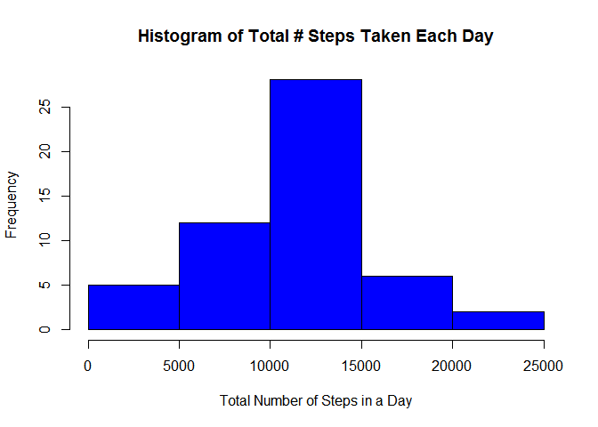
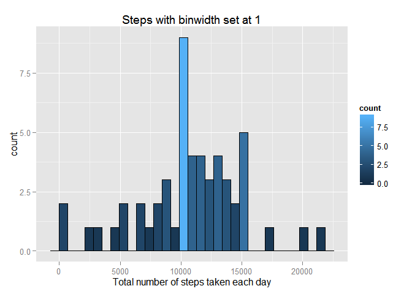
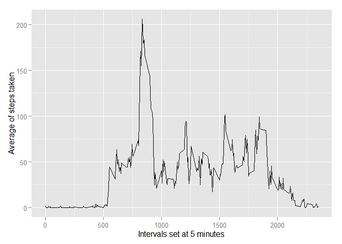
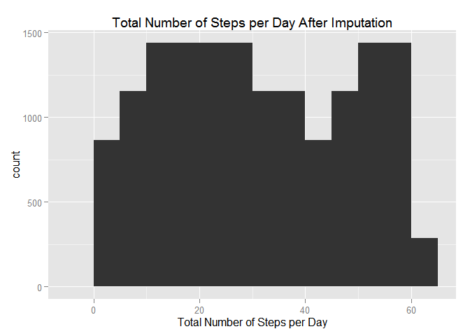

# Reproducible Research: Peer assessment 1
### *Madhavi Pullela*
### *3/8/2015*
### Github repository with RMarkdown source code: https://github.com/mps99/RepData_PeerAssessment1
==============================================================
  
  Loading and processing the data

```r
library(ggplot2)#needed for plots
library(xtable)#needed for pretty table
```

##Load the the data file,Check the first 5 rows of data before processing the data for the Project


```r
activityData1 <- read.csv("activity.csv")
actDataNotProcessed <- head(activityData1, 5)
actDataNotProcessed <- xtable(actDataNotProcessed, caption="First 5 rows: non-processed", label="Head Xtable", digits=1)
print(actDataNotProcessed, include.rownames = TRUE, caption.placement="top")
```

```
## % latex table generated in R 3.1.2 by xtable 1.7-4 package
## % Sun Mar 15 00:16:55 2015
## \begin{table}[ht]
## \centering
## \caption{First 5 rows: non-processed} 
## \label{Head Xtable}
## \begin{tabular}{rrlr}
##   \hline
##  & steps & date & interval \\ 
##   \hline
## 1 &  & 2012-10-01 &  0 \\ 
##   2 &  & 2012-10-01 &  5 \\ 
##   3 &  & 2012-10-01 & 10 \\ 
##   4 &  & 2012-10-01 & 15 \\ 
##   5 &  & 2012-10-01 & 20 \\ 
##    \hline
## \end{tabular}
## \end{table}
```
Initial Process and Removing the NA's in the data.
This step allows us to evalute the first five initial rows of data in the activityData data set after removing na. values.


```r
activityData <- na.omit(activityData1)
actDataProcessed <- head(activityData, 5)
actDataProcessed <- xtable(actDataProcessed, caption="First 5 rows: processed", label="HeadP Xtable", digits=1)
print(actDataProcessed, include.rownames = TRUE, caption.placement="top")
```

```
## % latex table generated in R 3.1.2 by xtable 1.7-4 package
## % Sun Mar 15 00:16:55 2015
## \begin{table}[ht]
## \centering
## \caption{First 5 rows: processed} 
## \label{HeadP Xtable}
## \begin{tabular}{rrlr}
##   \hline
##  & steps & date & interval \\ 
##   \hline
## 289 &  0 & 2012-10-02 &  0 \\ 
##   290 &  0 & 2012-10-02 &  5 \\ 
##   291 &  0 & 2012-10-02 & 10 \\ 
##   292 &  0 & 2012-10-02 & 15 \\ 
##   293 &  0 & 2012-10-02 & 20 \\ 
##    \hline
## \end{tabular}
## \end{table}
```

##Total Number of Steps in a Day

```r
activityData.steps <- aggregate(steps ~ date, activityData, sum)
hist(activityData.steps$steps, col="blue", main = "Histogram of Total # Steps Taken Each Day", xlab="Total Number of Steps in a Day")
```

 

New Bins set

```r
qplot(steps, data=activityData.steps, binwidth = "1", xlab = "Total number of steps taken each day",  main = "Steps with binwidth set at 1", na.rm=TRUE) +  geom_histogram(colour="black", aes(fill = ..count..)) 
```

```
## stat_bin: binwidth defaulted to range/30. Use 'binwidth = x' to adjust this.
```

 
stat_bin: binwidth defaulted to range/30. Use 'binwidth = x' to adjust this.
Steps with binwidth set at 1

##Calculate Mean Total Number of Steps per day

```r
mean(activityData.steps$steps)
```

```
## [1] 10766.19
```
## Calculate Median Total Number of Steps per day

```r
median(activityData.steps$steps)
```

```
## [1] 10765
```
Mean and median values are higher after imputing missing data. The reason is that in the original data, there are some days with  steps  values  NA  for any  interval . The total number of steps taken in such days are set to 0s by default. However, after replacing missing  steps  values with the mean  steps  of associated  interval  value, these 0 values are removed from the histogram of total number of steps taken each day.


```r
desc <- summary(activityData.steps) #from the psych library
desc <- xtable(desc, caption="Summary Statistics for Data", label="Description Xtable", digits=1)
print(desc, include.rownames = TRUE, caption.placement="top")
```

```
## % latex table generated in R 3.1.2 by xtable 1.7-4 package
## % Sun Mar 15 00:16:55 2015
## \begin{table}[ht]
## \centering
## \caption{Summary Statistics for Data} 
## \label{Description Xtable}
## \begin{tabular}{rll}
##   \hline
##  &         date &     steps \\ 
##   \hline
## 1 & 2012-10-02: 1   & Min.   :   41   \\ 
##   2 & 2012-10-03: 1   & 1st Qu.: 8841   \\ 
##   3 & 2012-10-04: 1   & Median :10765   \\ 
##   4 & 2012-10-05: 1   & Mean   :10766   \\ 
##   5 & 2012-10-06: 1   & 3rd Qu.:13294   \\ 
##   6 & 2012-10-07: 1   & Max.   :21194   \\ 
##   7 & (Other)   :47   &  \\ 
##    \hline
## \end{tabular}
## \end{table}
```

```r
desc <- summary(activityData.steps) #from the psych library
desc <- xtable(desc, caption="Summary Statistics for Data", label="Description Xtable", digits=1)
print(desc, include.rownames = TRUE, caption.placement="top")
```

```
## % latex table generated in R 3.1.2 by xtable 1.7-4 package
## % Sun Mar 15 00:16:55 2015
## \begin{table}[ht]
## \centering
## \caption{Summary Statistics for Data} 
## \label{Description Xtable}
## \begin{tabular}{rll}
##   \hline
##  &         date &     steps \\ 
##   \hline
## 1 & 2012-10-02: 1   & Min.   :   41   \\ 
##   2 & 2012-10-03: 1   & 1st Qu.: 8841   \\ 
##   3 & 2012-10-04: 1   & Median :10765   \\ 
##   4 & 2012-10-05: 1   & Mean   :10766   \\ 
##   5 & 2012-10-06: 1   & 3rd Qu.:13294   \\ 
##   6 & 2012-10-07: 1   & Max.   :21194   \\ 
##   7 & (Other)   :47   &  \\ 
##    \hline
## \end{tabular}
## \end{table}
```
## What is the average daily activity pattern?


```r
activityData.averages <- aggregate(x=list(steps=activityData$steps), by=list(interval=activityData$interval), FUN=mean)
ggplot(data=activityData.averages, aes(x=interval, y=steps)) + geom_line() + xlab("Intervals set at 5 minutes") + ylab("Average of steps taken")
```

 

```r
activityData.averages[which.max(activityData.averages$steps),]
```

```
##     interval    steps
## 104      835 206.1698
```
## Imputing missing values

There are many days/intervals where there are missing values (coded as  NA ). The presence of missing days may introduce bias into some calculations or summaries of the data.


```r
activityData.missing <- is.na(activityData$steps)
num.missing <- sum(activityData.missing)
table(activityData.missing)
```

```
## activityData.missing
## FALSE 
## 15264
```

```r
table (num.missing)
```

```
## num.missing
## 0 
## 1
```


```r
nafiller <- function(steps, interval){ filler <- NA
if (!is.na(steps))
filler <- c(steps)
else
filler <- (activityData.averages[activityData.averages$interval==interval, "steps"])
return(filler)
}
filled.activityData <- activityData
filled.activityData$steps <- mapply(nafiller, filled.activityData$steps, filled.activityData$interval)
head(filled.activityData)
```

```
##     steps       date interval
## 289     0 2012-10-02        0
## 290     0 2012-10-02        5
## 291     0 2012-10-02       10
## 292     0 2012-10-02       15
## 293     0 2012-10-02       20
## 294     0 2012-10-02       25
```

## For visualization with the filled in data set, we make a histogram.
First, let's find the day of the week for each measurement in the dataset. In this part, we use the dataset with the filled-in values.
Now, let's make a panel plot containing plots of average number of steps taken on weekdays and weekends.


```r
imputedData <- tapply(filled.activityData$steps, filled.activityData$date)
qplot(imputedData, binwidth=5, xlab="Total Number of Steps per Day", main="Total Number of Steps per Day After Imputation" )
```

 

From the above graph, we can notice that the activity on the weekday has the greatest peak from all steps intervals, and weekends activities has more peaks over a hundred than weekday. It could be inferred to the fact that activities on weekdays are lesser that the weekend activities. For the weekend activityies, there is a better distribution of activities along the time.
